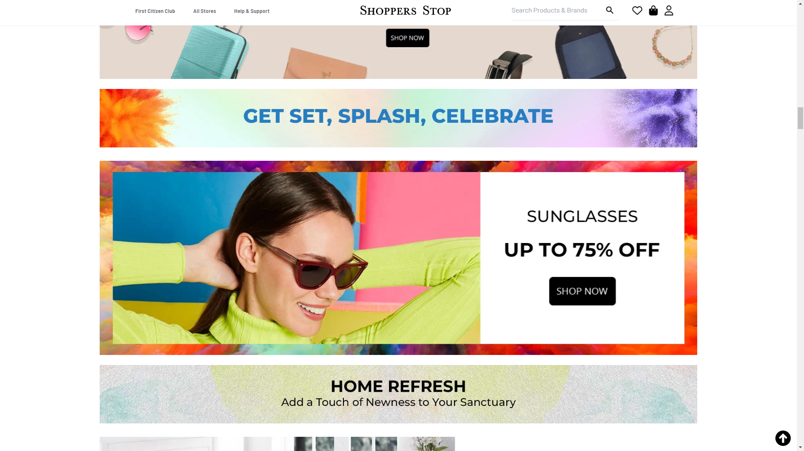
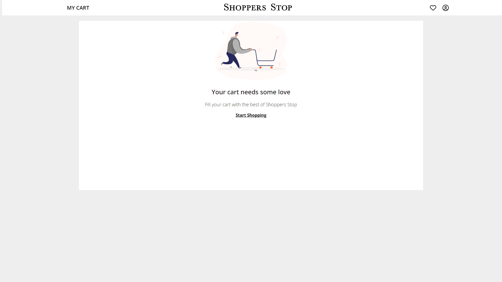
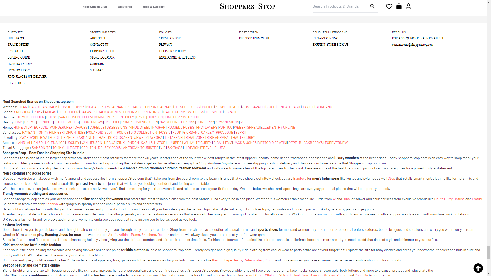

[HOSTED LINK 🔗](https://nsb199.github.io/Shoppers-Stop/)
---
[GitHub Repository](https://github.com/nsb199/Shoppers-Stop)
---

# Shoppers Stop Website Clone

## Table of Contents

1. [Introduction](#introduction)
2. [Project Overview](#project-overview)
3. [Features](#features)
4. [Technologies Used](#technologies-used)
5. [Getting Started](#getting-started)
6. [Challenges Faced and Resolutions](#challenges-faced-and-resolutions)
7. [Website UI Explanation](#website-ui-explanation)
8. [Screenshots](#screenshots)
9. [Conclusion](#conclusion)

## Introduction

This project is a clone of the Shoppers Stop website, created as part of the [Geekster](https://www.geekster.in/) Full Stack Development course as a Major Project for me and my team members:
1. [Neeraj](https://github.com/nsb199) (Team Captain)
2. [Anurag Shukla]()
3. [Prem Chavan]()
4. [Ankit Raghav]()
5. [Akshata Savukar]()

 The aim of this project is to replicate the user interface, functionality, and overall user experience of the original Shoppers Stop website.

## Project Overview

The Shoppers Stop website clone project is a comprehensive endeavor to closely mimic the design and features of the original website. It includes features such as product browsing, user account management, shopping cart functionality, checkout process, and responsive design.

## Features

- **Product Browsing**: Users can explore a wide range of products across various categories.
- **Responsive Design**: The clone is designed to be responsive, ensuring optimal viewing and interaction experience across devices.
- Intuitive user interface for easy navigation.
- Interactive product browsing experience with hover effects and smooth transitions.

## Technologies Used

- HTML5
- CSS3

## Getting Started

To run this project locally, follow these steps:

1. Clone the repository: `git clone [https://github.com/nsb199/Shoppers-Stop.git](https://github.com/nsb199/Shoppers-Stop.git)`
2. Open the `index.html` file in your browser.

## Challenges Faced and Resolutions

Throughout the project, we encountered various challenges, including layout inconsistencies, cross-browser compatibility issues, and performance optimizations. These challenges were addressed through collaboration, research, and experimentation.

## Website UI Explanation

The website UI closely resembles the original Shoppers Stop website, with a clean and intuitive design. The homepage features a carousel of featured products, followed by categories for easy navigation. Product pages include detailed descriptions, images, and pricing information, along with an "Add to Cart" button for easy shopping.

## Screenshots

## Conclusion

The Shoppers Stop website clone project represents more than just a replication of an existing website; it embodies our dedication to mastering frontend development and our commitment to delivering exceptional user experiences. Through meticulous attention to detail and creative problem-solving, we have not only recreated the look and feel of the original website but also added our own innovative touches.

As we bid farewell to this project, we look forward to the next challenge, where we will continue to push the boundaries of what is possible in web development. Our journey doesn't end here; it's just the beginning of a series of innovative projects that will redefine the way users interact with the web.

Thank you for joining us on this journey. We invite you to explore our Shoppers Stop website clone and experience the future of frontend development.

---
